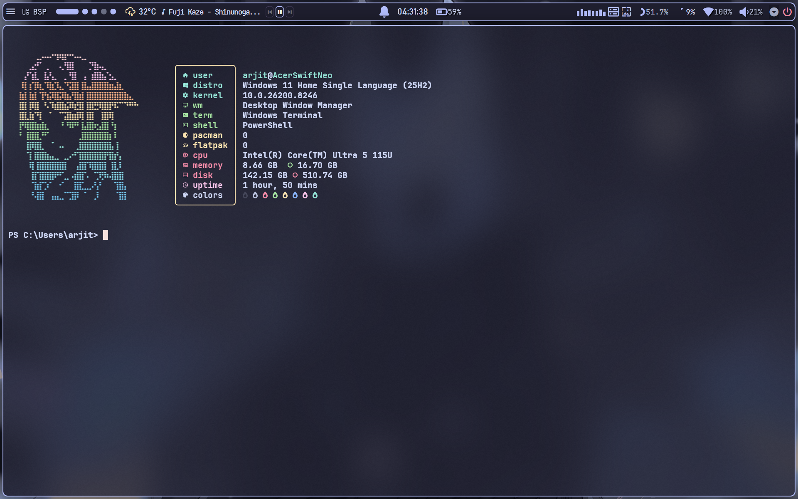
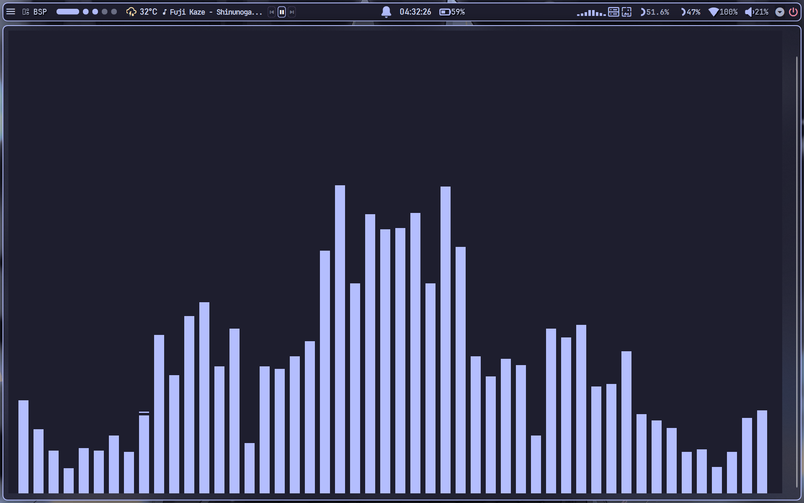
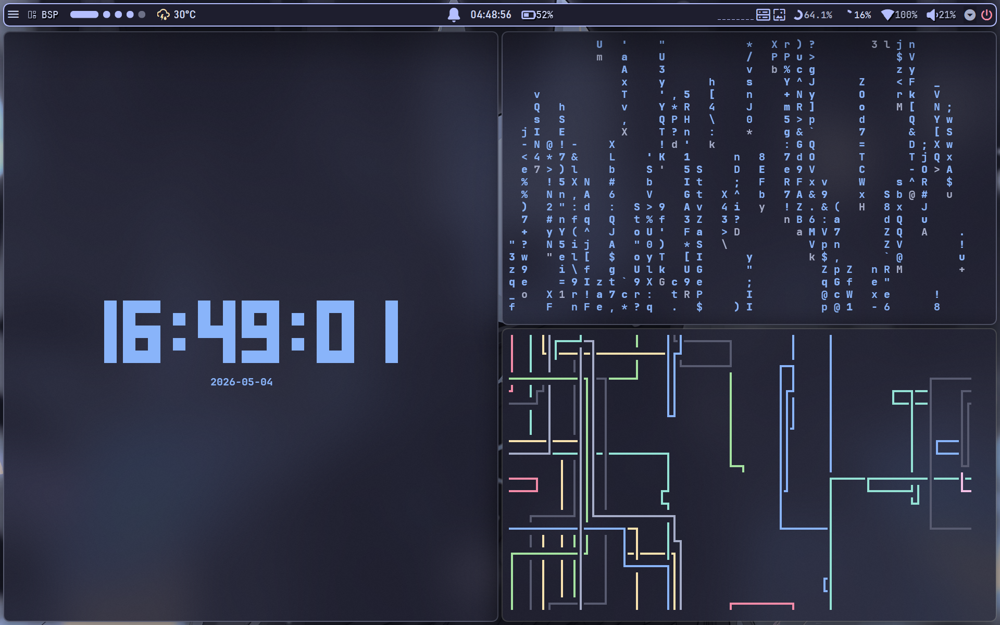

<!-- Windots -->  
  

  
    

  
  
<h1 align="center">  
    
  
    
  
    
</h1>  
  

  
    

  
  

  
<h1 align="center">🪟 Windows 11 Dotfiles</h1>
  
  Personal configuration files for my Windows 11 setup.   
  Focused on customization, productivity, and making Windows slightly less painful 💀  

<h2>📌 Overview</h2>  

  
This repository contains my dotfiles and configuration setup for Windows 11.  
It includes system customization tools, launcher configs, terminal settings,  
and development environment tweaks ⚙️  
  
  
 <h2>🖼️ Preview</h2>
  
      
      
      
     
<h2>📦 Prerequisites</h2>  
<ul>  
  <li>JetBrains Mono Nerd Font 🔤</li>  
</ul>  

  
 <h2>✨ Features</h2>  
  
-  🪟 **GlazeWM/Komorebi** setup  
-  🎨 Beautiful **YASB** config  
-  🧠 Minimal **VSCode** setup  
-  🖥️ Sleek **Windows Terminal** config  
-  ⚡ **PowerShell** config  
-  🚀 Minimal **Fastfetch** config  
-  🔍 **Flow Launcher** config  
-  🎛️ Themeable **Start menu, Taskbar and Notification center**  
-  🖼️ Beautiful [**Wallpapers**](https://github.com/YummyYakuza/Wallpapers)  
-  🍮 [**Catppuccin**](https://github.com/catppuccin) everywhere  
  
---  
<h2>🛠️ Tools Used</h2>  
  
<ul>  
  <li><b>OS:</b> 🪟 <a href="https://www.microsoft.com/windows/windows-11">Windows 11</a>  <a href="https://learn.microsoft.com/en-us/windows/wsl/">WSL2</a> </li>  
  <li><b>WM:</b> 🧩<a href="https://github.com/LGUG2Z/komorebi">Komorebi</a> / <a href="https://github.com/glzr-io/glazewm">GlazeWM</a></li>  
  <li><b>Shell:</b> 🐚 <a href="https://learn.microsoft.com/en-us/powershell/">PowerShell</a> / <a href="https://zsh.sourceforge.io/">zsh</a> </li>  
  <li><b>Terminal Emulator:</b> 🖥️ <a href="https://github.com/microsoft/terminal">Windows Terminal</a> </li>  
  <li><b>Panel:</b> 📊 <a href="https://github.com/amnweb/yasb">YASB</a> </li>  
  <li><b>Text Editor:</b> ✍️ <a href="https://neovim.io/">Neovim</a> / <a href="https://code.visualstudio.com/">VS Code</a> </li>  
  <li><b>App Launcher:</b> 🚀 <a href="https://www.flowlauncher.com/">Flow Launcher</a> </li>  
  <li><b>File Manager:</b> 📁 <a href="https://yazi-rs.github.io/">Yazi</a> </li>  
  <li><b>System Monitor:</b> 📈 <a href="https://github.com/aristocratos/btop">btop</a> </li>  
  <li><b>Colorscheme:</b> 🍮 <a href="https://catppuccin.com/">Catppuccin</a> </li>  
</ul>  

<h2>⚙️ Setup</h2>  
  
<blockquote>  
<b>⚠️ WARNING:</b> These configs are <b>not plug-and-play</b> 🚧   
Cherry-pick what you need. Backup before applying.  
</blockquote>  
  

  

<b> GlazeWM</b>
  
   
<ul>  
  <li>Install <a href="https://github.com/glzr-io/glazewm/releases">GlazeWM</a></li>  
  <li><a href="Glazewm/config.yaml"><code>Glazewm/config.yaml</code></a></li>  
</ul>  

  
  

  

<b>YASB</b>
  
   

<b>NOTE:</b> Requires a Nerd Font (JetBrainsMono Nerd Font recommended).
  
<ul>  
  <li>Install <a href="https://github.com/amnweb/yasb/releases">YASB</a></li>  
  <li><a href="Yasb/"><code>Yasb/</code></a></li>  
</ul>  

  
  

  

<b> Windows Terminal</b>
  
   
<ul>  
  <li>Install <a href="https://github.com/microsoft/terminal">Windows Terminal</a></li>  
  <li><a href="Windows-Terminal/settings.json"><code>Windows-Terminal/settings.json</code></a></li>  
</ul>  

  
  

  

<b> PowerShell</b>
  
   
<ul>  
  <li>Install <a href="https://learn.microsoft.com/en-us/powershell/scripting/install/install-powershell">PowerShell</a></li>  
  <li><a href="WindowsPowershell/Microsoft.PowerShell_profile.ps1"><code>WindowsPowershell/Microsoft.PowerShell_profile.ps1</code></a></li>  
</ul>  

  
  

  

<b> Zsh</b>
  
   

Available via WSL2 (Ubuntu).
  
<ul>  
  <li><a href="zsh/.zshrc"><code>zsh/.zshrc</code></a></li>  
</ul>  

  
  

  

<b> Komorebi</b>
  
<ul>  
<li>Install <a href="https://github.com/LGUG2Z/komorebi/releases">Komorebi</a></li>  
<li><a href="Komorebi/"><code>Komorebi/</code></a></li>  
</ul>  

  
  

  

<b>Flow Launcher</b>
  
   
<ul>  
  <li>Install <a href="https://www.flowlauncher.com">Flow Launcher</a></li>  
  <li><a href="FlowLauncher/"><code>FlowLauncher/</code></a></li>  
</ul>  

  
  

  

<b> Windhawk</b>
  
   
<ul>  
  <li>Install <a href="https://windhawk.net">Windhawk</a></li>  
  <li>Required mods:  
    <ul>  
      <li>Notification Center Styler</li>  
      <li>Start Menu Styler</li>  
      <li>Taskbar Styler</li>  
    </ul>  
  </li>  
  <li><a href="Windhawk/"><code>Windhawk/</code></a></li>  
  <li>Paste configs via: <b>Mod → Advanced → Mod Settings → Load</b></li>  
</ul>  

  
  

  

<b> Fastfetch</b>
  
   
<ul>  
  <li>Install:  
    <pre>winget install fastfetch</pre>  
  </li>  
  <li><a href="fastfetch/config.jsonc"><code>fastfetch/config.jsonc</code></a></li>  
</ul>  

  

  

<b>VS Code</b>
  
   
<ul>  
  <li>Install <a href="https://code.visualstudio.com/download">VS Code</a></li>  
  <li><a href="Vs-Code/settings.json"><code>Vs-Code/settings.json</code></a></li>  
</ul>  

  
  

<h2>📜 License</h2>  

MIT License
  

<h2>🙏 Credits</h2>  
  
Special mention to the following resources and projects that were especially helpful during setup:  
  
- [**GlazeWM**](https://github.com/glzr-io/glazewm) for delivering an outstanding **tiling window manager** that boosts productivity 🧩  
- [**YASB**](https://github.com/amnweb/yasb) for a **customizable and feature-rich status bar** that fits seamlessly into the setup 📊  
- [**Catppuccin**](https://catppuccin.com) for creating the **best color scheme** ever 🍮🔥  
- [**Ashish**](https://github.com/ashish0kumar) and [**Swopnil**](https://github.com/swopnil7) for some of the **file configs** & **readme design** 🧠✨
